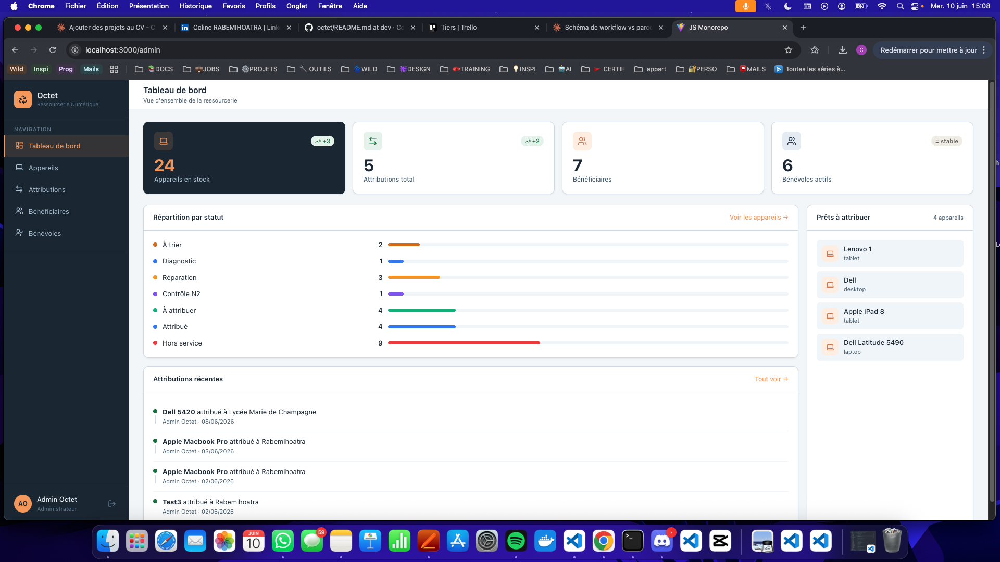
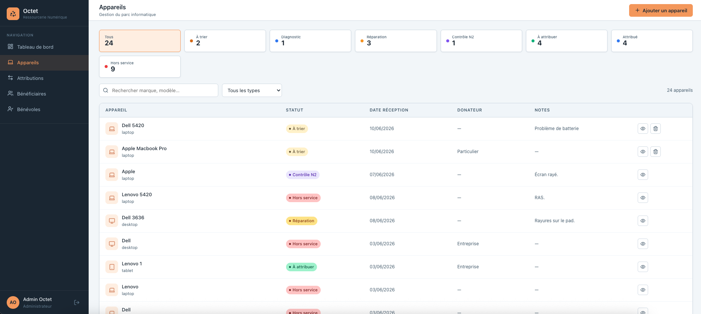
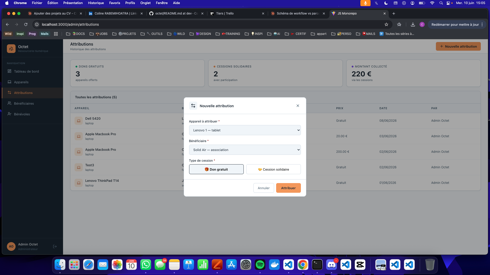

# 🔁 Octet — Ressourcerie Numérique

> Collecter, reconditionner, redistribuer. Réduire la fracture numérique, un appareil à la fois.



[](https://react.dev)
[](https://www.typescriptlang.org)
[](https://nodejs.org)
[](https://www.mysql.com)
[](https://www.mongodb.com)
[](https://railway.app)

---

## Présentation

**Octet** est une application web de gestion pour ressourcerie numérique — une structure qui collecte du matériel informatique usagé, le diagnostique, le répare et le redistribue à des bénéficiaires (familles, écoles, associations).

Elle couvre l'ensemble du workflow métier : de la collecte d'un appareil jusqu'à son attribution, en passant par les étapes de diagnostic, réparation et contrôle qualité.

Deux profils utilisateurs : **Admin** (pilotage global) et **Bénévole** (traitement terrain).

---

## Aperçu

| Dashboard admin | Liste des appareils | Modale d'attribution |
|-----------------|--------------------|--------------------|
|  |  |  |

---

## Fonctionnalités

### Profil Admin
- Tableau de bord avec statistiques (appareils, attributions, bénévoles actifs)
- Gestion du parc d'appareils — ajout, suivi du statut, suppression
- Gestion des bénéficiaires — familles, écoles, associations
- Gestion des bénévoles — création de compte, activation / désactivation
- Historique des attributions — dons et cessions solidaires
- Logs d'activité en temps réel (MongoDB)

### Profil Bénévole
- File de travail : diagnostic → réparation → contrôle qualité N2
- Mise à jour du statut et ajout de notes sur chaque appareil
- Historique des appareils traités
- Règle métier : le contrôle N2 ne peut pas être effectué par le bénévole qui a réparé l'appareil

---

## Stack technique

| Côté client | Côté serveur | Données |
|-------------|--------------|---------|
| React 18 + TypeScript | Node.js + Express + TypeScript | MySQL 8 (données métier) |
| Vite + Biome | JWT (24h) + Argon2 | MongoDB (logs d'activité) |
| Lucide React | CORS | |

---

## Installation locale

### Prérequis

- Node.js 18+
- MySQL 8
- MongoDB (local ou Atlas)

### 1. Cloner le projet

```bash
git clone https://github.com/ColineRbm/octet.git
cd octet
```

### 2. Installer les dépendances

```bash
npm install
```

### 3. Configurer les variables d'environnement

```bash
cp server/.env.sample server/.env
```

Renseigner les valeurs dans `server/.env` :

```env
APP_PORT=3310
DB_HOST=localhost
DB_PORT=3306
DB_USER=votre_user
DB_PASSWORD=votre_password
DB_NAME=recyclerie
JWT_SECRET=votre_secret_genere
CLIENT_URL=http://localhost:5173
MONGODB_URI=mongodb://localhost:27017/octet_logs
```

### 4. Créer la base de données

```bash
npm run db:migrate
```

### 5. Lancer le projet

```bash
npm run dev
```

L'application est accessible sur `http://localhost:5173`

---

## Comptes de test

| Rôle | Email | Mot de passe |
|------|-------|--------------|
| Admin | admin@octet.fr | Admin1234! |
| Bénévole | marie.lambert@octet.fr | Admin1234! |

---

## Commandes disponibles

| Commande | Description |
|----------|-------------|
| `npm run dev` | Démarre client et serveur en parallèle |
| `npm run db:migrate` | Recrée la base MySQL depuis le schéma |
| `npm run check` | Lint + vérification TypeScript (Biome) |

---

## Sécurité

- Authentification JWT avec expiration 24h
- Mots de passe hashés avec Argon2
- Validation des entrées côté serveur sur toutes les routes POST/PUT
- Protection des routes par rôle (`verifyToken` + `isAdmin`)
- `password_hash` jamais exposé dans les réponses API
- Rôle utilisateur jamais accepté depuis `req.body` — hardcodé en base

---

## Architecture

```
octet/
├── client/                 # React + TypeScript
│   └── src/
│       ├── components/     # Composants réutilisables (ui/, layout/)
│       ├── constants/      # Données statiques (STATUS_CONFIG...)
│       ├── contexts/       # AuthContext
│       ├── hooks/          # Hooks custom (useDevices, useUsers...)
│       ├── pages/          # Pages par profil (Admin/, Benevole/)
│       ├── services/       # Appels API (api.ts)
│       └── types/          # Interfaces TypeScript centralisées
│
└── server/                 # Node.js + Express + TypeScript
    ├── database/           # Schéma SQL + client MySQL
    └── src/
        ├── middlewares/    # Auth JWT + validation des entrées
        ├── modules/        # Par entité : actions + repository
        └── router.ts       # Routes API
```

---

## Déploiement

L'application est déployée sur [Railway](https://railway.app).  
Voir la [documentation de déploiement](docs/DEPLOIEMENT.md) pour reproduire la configuration.

---

## Auteure

Coline Rabemihoatra — projet de certification RNCP37674 Développeur Web et Web Mobile  
Wild Code School Lille — 2026
